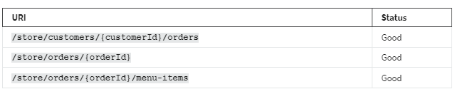
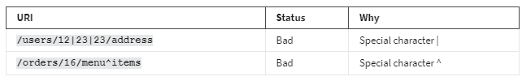
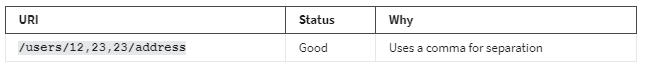
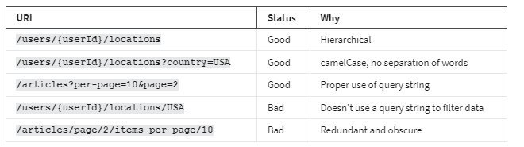

<h1>Good routes versus bad routes</h1>

<h2>Introduction </h2>
Naming your API properly is the first step in designing a good API. When the API name follows a convention, it provides lots of information about the API and its purpose. To create a meaningful API endpoint, you need to follow some simple guidelines and rules. 

In this reading, you will learn about API naming conventions and familiarize yourself with good API endpoints vs. bad API endpoints, or good and bad routes.

<h2>Rule 01: Everything in lowercase, with hyphens and not abridged</h2> 
The URI of your API should always be in lowercase. Do not use camelCase, PascalCase or Title case when you design your API. Also, separate multiple words using hyphens, not underscores. Do not keep abridged, or shortened, words in your URI; always use the full and meaningful form.

If your API accepts a variable, you should always represent it in camelCase, and wrap it inside a set of curly braces {}.

Let’s examine the following examples.

<h2>Rule 02: Use a forward slash to indicate a hierarchical relationship</h2>
In your API URI, always use the forward slash to indicate a hierarchical relationship. To understand this rule, consider the following scenarios and the relationship from the API endpoints. 

A store can have customers who have placed many orders and each of these orders can have delivery addresses, menu items and bills

Similarly, a library can have books from many authors. Each of these books has an ISBN number.

<h2>Rule 03: Use nouns for resource names, not verbs</h2>
One of the most prominent features of REST APIs is that it uses nouns to indicate resources, not verbs. And you should always stick to this rule when designing your API. You should also use plural nouns to indicate a collection.

<h2>Rule 04: Avoid special characters </h2>
You should always avoid special characters in your API endpoints. They can be confusing and technically complex for your users. Consider the following bad examples.

If your API can accept multiple user ids, then they should be separated using a comma, as demonstrated below.

<h2>Rule 05: Avoid file extensions in URI</h2>
You should always avoid file extensions in your API names. For example, if your API can deliver an output in both JSON and XML format, it should never look like this.

Instead, your client should be able to indicate its expected format in a query string, just like this. 

Similarly, if your API is serving a static file, for example, CSS or JavaScript files, you should use endpoints like the following to deliver the minified and original source file. You can also use a query string to get the minified or original version.  Some API developers use the output format like file extension at the end of the regular API endpoints, which is also bad practice.    

<h2>Rule 06: Use query parameters to filter when necessary </h2>
When designing your API, you should always perform data filtering using a query string. This is the same when you expect some extra parameters, like the number of items per page and page number. 

Consider this example of a travel site. You want to find which locations a particular user has traveled to. And then you want to know which locations in the USA the user has already seen. 

<h2>Rule 07: No trailing slash</h2>
When sharing your API endpoint with others in your team, or in public, avoid using a trailing slash at the end of your API endpoints. Consider the following examples.

<h2>Conclusion</h2>
Now you understand how to create REST API endpoints with good names. Remember, a consistent naming strategy for your API is one of the most important design decisions for the whole project!