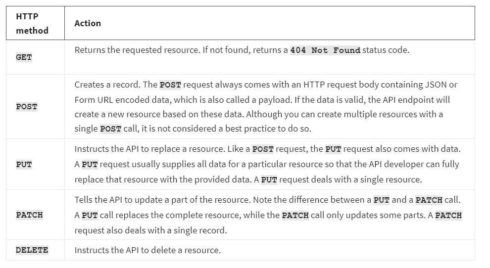
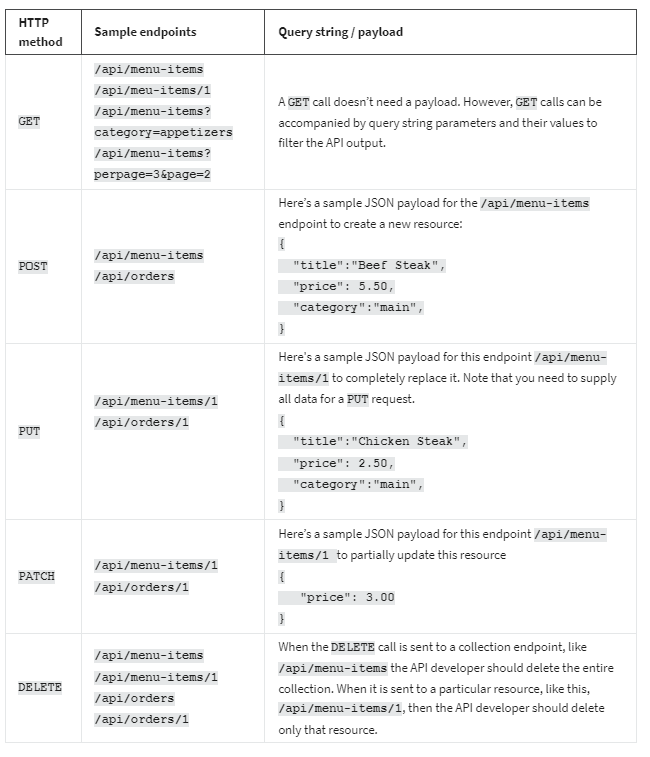
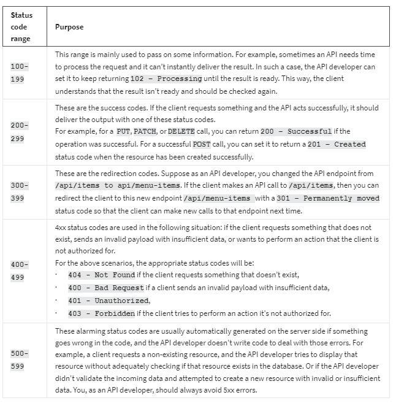
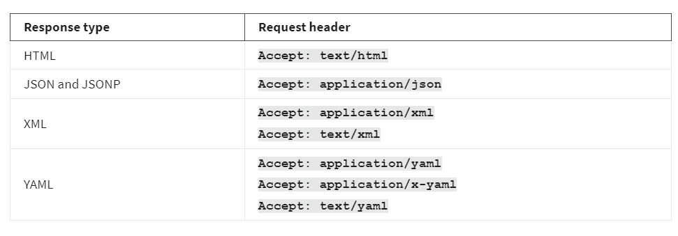

<h1>HTTP methods, status codes and response types</h1>

<h2>Introduction </h2>
You already know that HTTP methods and status codes play an essential role in REST APIs. It is important to keep to the conventions for HTTP methods and status codes for two reasons. Firstly, if you follow conventions from the developing phase, it will be much easier to avoid bugs in your code and deploy the final project on the production server. Secondly, it makes it easier for other developers to use your APIs. This reading highlights the most important HTTP methods, status codes and API response types that you will use when working on API projects.

<h2>HTTP methods</h2>
In the world of REST APIs, one endpoint can perform multiple tasks. It can deliver a resource, create a new resource, update or delete it. The endpoint remains the same while the action varies. When a client invokes an API, how does the API developer know which of the multiple actions should be performed?  This is where HTTP methods come in.   

HTTP methods or request types tell the API endpoint what it should do with the resources. It defines the action. The API developer makes decisions and manipulates resources appropriately based on the HTTP methods in an HTTP request. Here is a list of the most used HTTP methods and which action you should initiate for those calls. 

<h2>Example calls</h2>

<h2>Status codes</h2>
Sending appropriate status codes with every API response is essential. And as a developer, you should not just pick any code. Every status code has meaning, so you should choose the most appropriate one based on the situation. Here’s a list of the status code ranges and their purposes. 

<h2>Response types</h2>
These days, the most common response types involved with REST APIs are JSON, XML, plain text, and sometimes YAML. Frameworks like DRF come with built-in renderer classes that can convert the data into an appropriate format and display it correctly.

There are also third-party renderers available for this job. While making an API call, the client can specify its desired response format with the Accept HTTP header. And that header should be considered to deliver the result in that format using the render classes. Here’s a list of HTTP headers for different response types.  

<h2>Conclusion</h2>
In this reading, you learned about different types of HTTP methods, status codes, and API response types.