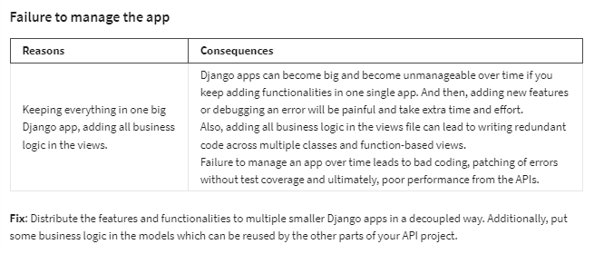

<h1>Consequences of a poorly designed API project</h1>

<h2>Introduction </h2>
Creating a good API project can be challenging. You need to stick to the conventions, write proper error checks in your code, perform security checks, and make sure that your APIs are using processing power and bandwidth optimally. This all takes time and proper planning. But what happens if you don’t properly plan and execute your APIs?

Let’s examine some of the consequences of a poorly designed API project.

<h2>Conclusion</h2>
Taking the time to properly design an API project from the start will save you time and effort over the course of a project. The consequences of a poorly designed API affect everyone who uses your API, including the API developers and client application developers.

The knowledge you gained in this reading will hopefully remind you of everything you need to keep in mind to make your future API projects successful.