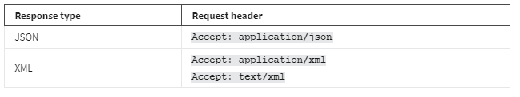
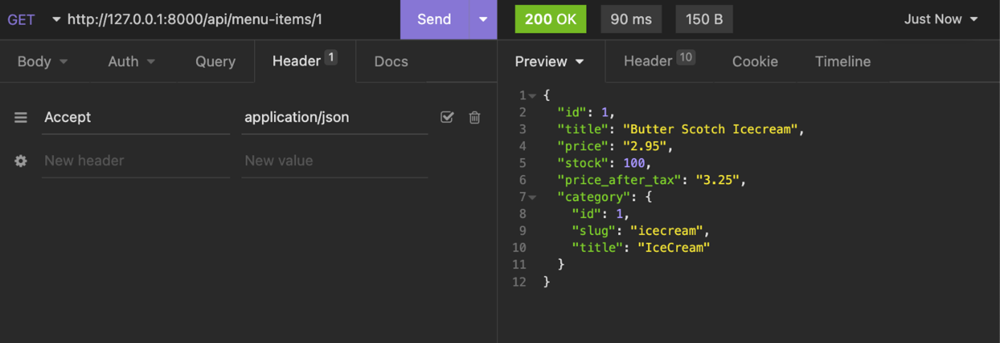
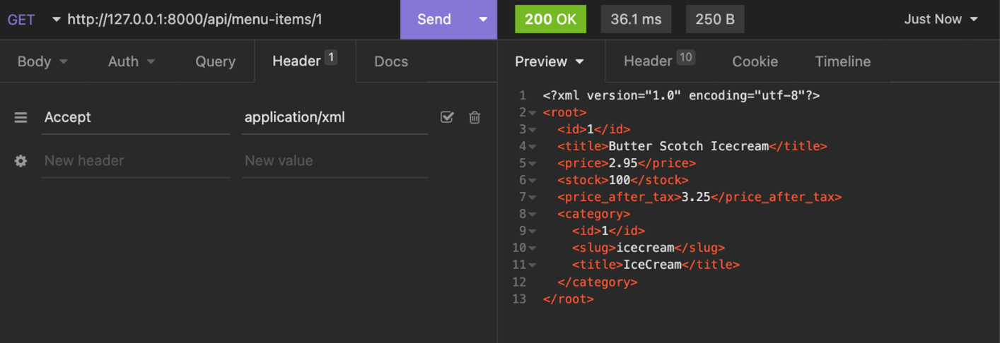
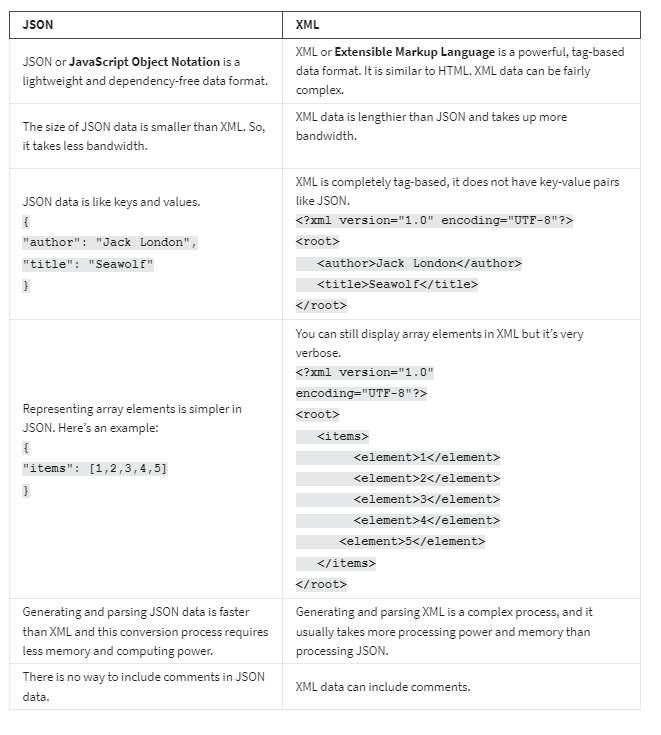

<h1>XML and JSON response types</h1>

<h2>Introduction</h2>
When it comes to displaying output, an API developer should always allow the client to request the preferred content type, such as JSON or XML. Clients can do this by supplying an additional header called Accept in the request header. You learned about this in the reading, 
HTTP methods, status codes and response types
. In this way, the client has full flexibility to use the content in the way they want to. In this reading, you’ll learn more about the two data formats that you will encounter the most in requests from clients, JSON and XML.

<h2>Request headers </h2>
Client applications need to send Accept request headers with every HTTP request to receive the output in JSON or XML. For example:

The client can send an Accept header in an HTTP GET request and depending on the request header, the same data will be displayed differently in JSON and XML. Below is a screenshot of an API request for a JSON response.

And here is the same API request but for an XML response.

<h2>Data conversion</h2>
In this course, you will build APIs using Django and Django REST framework, also called DRF. DRF has built-in renderers that can convert your data to JSON and represent it in an interactive, browsable API viewer. There are also third-party renderer classes that can convert these data to XML or YAML. You will learn about these features and write actual code later in this course.  

,h2>JSON versus XML
JSON gained popularity because it’s very simple and lightweight. And creating JSON data or parsing it is easier than XML. However, XML has its own advantages too. XML is more readable and supports data attributes that are not possible in JSON. And you can represent complex data in XML and still keep it readable. JSON is very popular among JavaScript developers because they can instantly read and write JSON data just like a regular object. 

The table below compares some of the features of both formats. 

<h2>Conclusion</h2>
It is clear that JSON and XML both have benefits and limitations. Later in this course, you will learn how to display API output in both formats, but you will mostly use JSON in this course because it’s very simple and lightweight. 