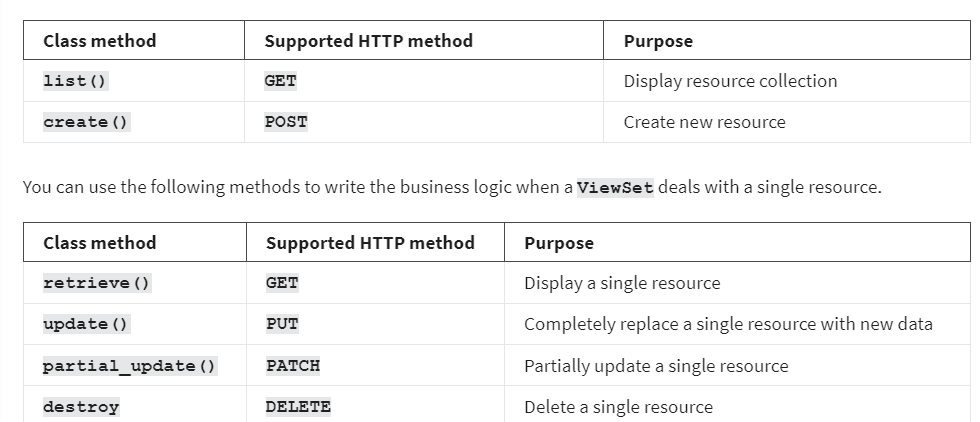
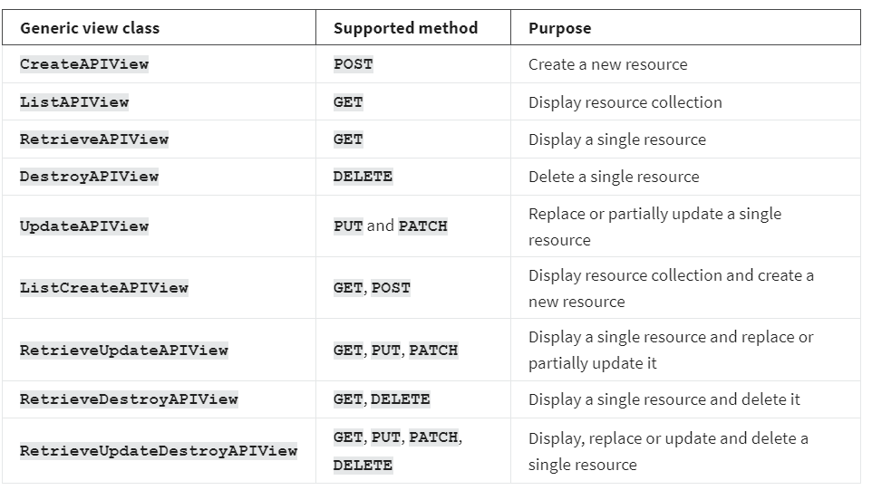

<h1>Generic views and ViewSets in DRF</h1>

<h2>Introduction</h2>
DRF comes with many generic views and ViewSet to speed up API development. When you use these classes, you don’t need to start from scratch and using them will reduce the code in your API project. In this reading, you will learn about different types of generic views and ViewSet as well as their purposes and benefits. 

<h2>ViewSets</h2>
ViewSets are simple class-based views, but they come with benefits. There are a few ViewSets classes available in DRF that you can use to quickly scaffold a functioning API CRUD project. You can also provide permission classes and throttle classes to allow authenticated API calls and rate limiting.

To use these classes, you must import the viewsets module from the rest_framework:  
from rest_framework import viewsets

<h2>ViewSet </h2>
There are a few ViewSet classes but the foundation is ViewSet and it extends the APIView. When your class-based views extend a ViewSet you get browsable API views out of the box. Except for that, every ViewSet comes with a method naming convention for easier one-line routing that saves a lot of time. 

When a ViewSet is used to deal with a collection of resources, you can write your business logic in list() and create() methods inside this class. 

When you extend a ViewSet, you will have to manually write code to perform the database operations. But there are two more ViewSet classes that can automatically do that for you. This is how you extend a ViewSet class.

class MenuItemViewSet (viewsets.ViewSet)

<h2>ModelViewSet</h2>
If the class-based view extends a ModelViewSet, it can automatically handle CRUD operations for you. All you must do is give this class a queryset and a serializer, and everything else will be done automatically.  You don’t need to write code for all those database operations anymore. Later in this course, you will see a practical example of using ModelViewSet to write a functioning CRUD API project with only a few lines of code. Here’s an example of how to extend this ViewSet.

class MenuItemView (viewsets.ModelViewSet)

<h2>ReadOnlyModelViewSet</h2>
As the name suggests, when your class-based views extend a ReadOnlyModelViewSet, it can only display a single resource and resource collection. No write-operation is allowed by such views, so it doesn’t handle POST, PUT, PATCH or DELETE methods.  Here’s an example of extending a ReadOnlyModelViewSet.

class ReadOnlyMenuItemView (viewsets.ReadOnlyModelViewSet)

<h2>Generic views</h2>
Generic views are another way of quickly writing class-based views to scaffold fully functional CRUD API projects. There are several generic views that offer a particular functionality, like displaying resources or creating a new resource and so on. All you must do is extend these generic views to make your API endpoints work. 

To use these generic view classes, you must import the generics module from the rest_framework.

from rest_framework import generics

All generic view classes require a queryset and a serializer to work properly. 

Here is a list of generic views in DRF and their purposes.

<h2>Example code </h2>
If you want API endpoints to be capable of displaying resource collection and creating a new resource, you have to extend both ListAPIView and CreateAPIView, or just ListCreateAPIView. Both of the following lines of code do the same job.

class MenuItemView (generics.ListAPIView, generics.CreateAPIView)

And
class MenuItemView (generics.ListCreateAPIView)

Just like ModelViewSet, you must give these generic view classes a queryset and a serializer and you don’t need to manually write code to perform these database operations. 

<h2>Authentication and selective authentication</h2>
If you want all API calls to be authenticated in a class-based view that extends the generic views, you can add the permission_classes public attribute in the class. 

Permission_classes = [IsAuthenticated]

If you want to selectively enable authentication for some calls, like POST, PUT, PATCH and DELETE then you need to override the get_permission method in your class-based view like this.

def get_permissions(self):
        permission_classes = []
        if self.request.method != 'GET':
            permission_classes = [IsAuthenticated]
            
        return [permission() for permission in permission_classes]

This way, anyone will be able to make GET call, but other HTTP methods like POST, PUT, PATCH and DELETE will require authentication or a valid user token.

<h2>Return items for the authenticated user only </h2>
Sometimes in a class-based view that extends a generic view, you may want to return resources created by the authenticated users only. In that case, you need to override the get_queryset method. The following code in a class-based view returns only those orders created by the authenticated user. 

class OrderView(generics.ListCreateAPIView):
    queryset = Order.objects.all()
    serializer_class = OrderSerializer
    permission_classes = [IsAuthenticated]
    def get_queryset(self):
        return Order.objects.all().filter(user=self.request.user)

<h2>Override default behavior </h2>
Though generic views automate everything, you still have full scope to change the default behavior by overriding any of the default methods. Here is an example that returns a simple static response instead of the resources. 

class OrderView(generics.ListCreateAPIView):
    queryset = Order.objects.all()
    serializer_class = OrderSerializer  
    def get(self, request, *args, **kwargs):
        return Response(‘new response’)

The other methods you can override are post(), put(), patch() and delete().

<h2>Conclusion</h2>
In this reading, you explored the ViewSet classes and generic view classes which can help you to scaffold a fully functional CRUD API project in a very short time. 