<h1>Importance of data validation</h1>
<h2>Introduction </h2>
Data validation is an important step in every web application because it ensures that user data is valid and sufficient. In this reading, you will learn about different validation techniques in DRF.

<h2>Validation</h2>
Validation is the process of ensuring that user-submitted data is in the correct format, meets the requirements and is safe to add to the database. The serializers in DRF provide different features which you can use to validate these data while building your APIs. Before jumping into the details let’s examine some user inputs while adding or modifying the menu items in the Little Lemon API project and how they should be validated.

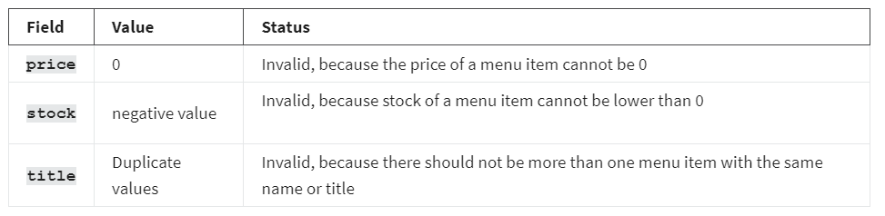

Besides these common validations, every project has additional requirements. For example, in the Little Lemon project, you can set it so that the price can’t be less than 2.0. And if someone tries to add items with a price below 2.0, it will raise an error. Some of the validation functionalities in DRF will now be discussed.

<h2>Validation in DRF</h2>
There are two serializers in the serializers.py file, MenuItemSerializer and CategorySerializer.

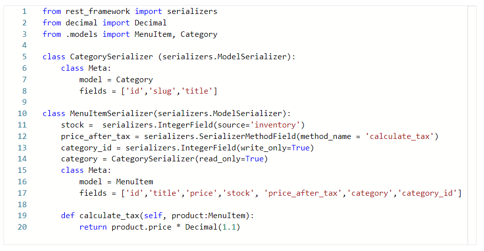

What follows are four different ways in which to modify some fields in the MenuItemSerializer.

<h3>Method 1: Conditions in the field</h3>
For the price field, the validation rule is that it should not accept prices less than 2.0. To achieve that result, add the following line before the Meta class in the MenuItemSerializer.

price = serializers.DecimalField(max_digits=6, decimal_places=2, min_value=2)

If you make a POST call to the menu-items endpoint, with the price set to 1, DRF will display the error that the price should be greater than or equal to 2. The validation works.

<h3>Method 2: Using keyword arguments in the Meta class</h3>
If the field is not declared above the Meta field, you can still validate it using keyword arguments in the Meta class. For this method, you need to remove the line you added in the previous section. Add an extra_kwargs section in the Meta class with the following code. This extra_kwargs section allows you to add additional properties and validations for every field in the serializer.

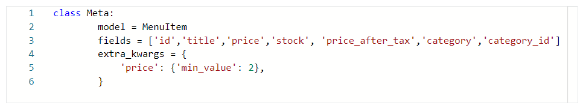

If you send the previous POST call, you will see the same error displayed in Method 1.

You can add additional validation so that the stock cannot go below 0. Add the following line in the extra_kwargs section in the Meta class.

'stock':{'source':'inventory', 'min_value': 0}

Here is the complete code of MenuItemSerializer class.

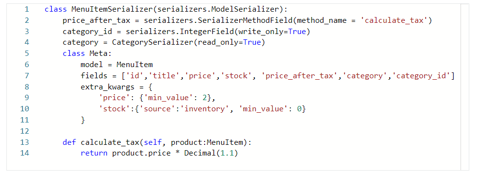

if you send a negative stock value in an HTTP POST call, DRF will give you an error like in the screenshot below.

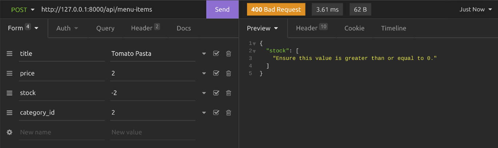

<h3>Method:3 Using validate_field() method </h3>
Serializers in DRF provide you with another clean way of validating user input by writing valid_field() methods, where you replace the field with an actual field name. If the field name is price, the method name has to be validate_price(). If the field name is stock, then the method name has to be validate_stock().

Add the following two methods above the Meta class in the MenuItemSerializer.

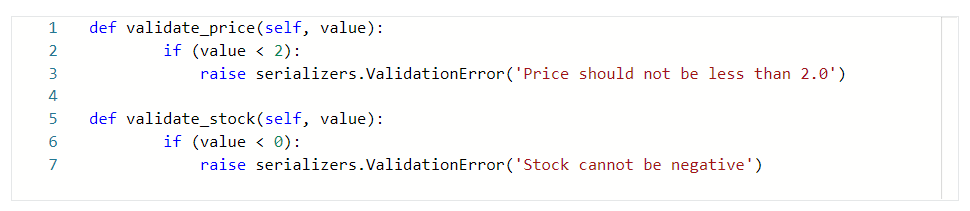

In these methods, the user-submitted data is passed as a value. As the API developer you need to check if the value meets the requirement, otherwise, raise the ValidationError with a message. 

Test this by sending a POST request with invalid values in the price and stock fields. You should get the error message displayed in the screenshot below.

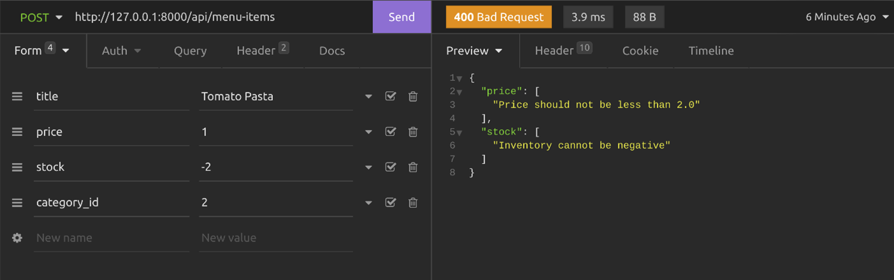

<h3>Method 4: Using the validate() method </h3>
You can add a validate() method in the serializer and validate multiple field values at once. DRF will pass all input values to this method. Here’s an example of how to validate the price and inventory values using a validate() method. 

Note: To follow this method you need to remove the previous two methods validate_stock and validate_price in the serializer.

Add the following code above the Meta class in the MenuItemSerializer.

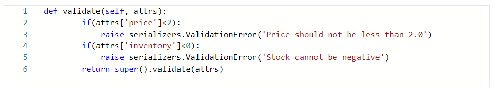

Note:  You used the actual field name for validating the stock which is inventory. If you send a POST request to the menu-items endpoint, you will see an error like the screenshot below.

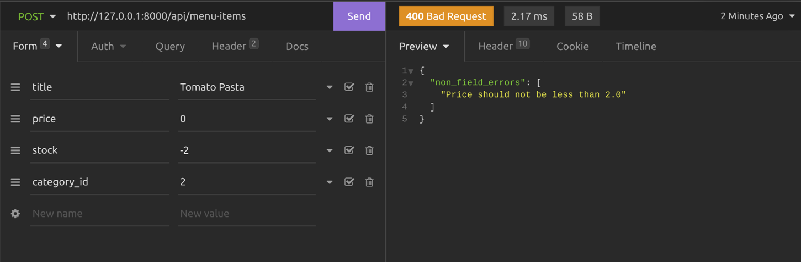

<h2>Unique validation</h2>
Sometimes API developers need to make sure that there is no duplicate entry made by the clients. In such cases, unique validators become useful. Using this validator, you can ensure the uniqueness of a single field or combination of fields. Let’s examine how to use this validator. For a single field, use UniqueValidator class and for the combination of fields, use UniqueTogetherValidator.

<h2>UniqueValidator</h2>
First, import the classes. 

from rest_framework.validators import UniqueValidator

or 

from rest_framework.validators import UniqueTogetherValidator

To make sure that the title field remains unique in the MenuItems table, you can add the following code in the extra_kwargs section in the Meta class. Here's an example of using UniqueValidator forthe title field.   

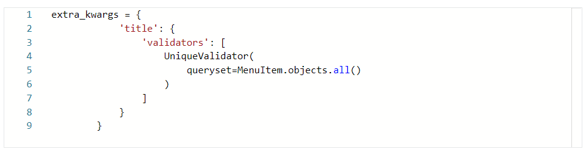

Or you can add it when declaring a field above Meta class, like this.

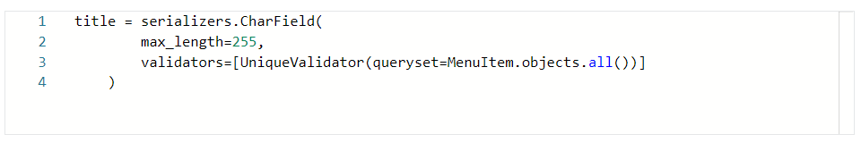

If the client sends a duplicate entry, they will see an error as below.

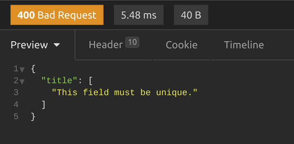

<h3>UniqueTogetherValidator</h3>
When you want to use UniqueTogetherValidator validator, the code will be a little different. Here’s a sample code that will make the combination of title and price field unique. With this validation, there will be no duplicate entry of an item with the same price. This code goes directly inside the Meta class.

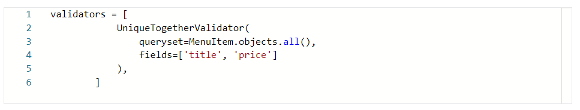

If the client sends a duplicate entry, they will see an error as below.

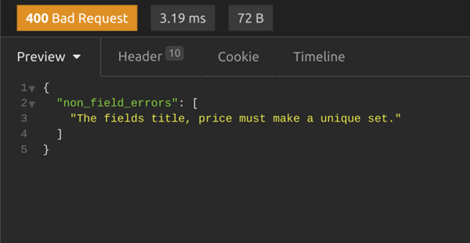

<h2>Conclusion</h2>
In this reading, you learned about the importance of data validation and four different methods that you can follow to modify certain fields in the MenuItemSerializer to validate data in DRF.