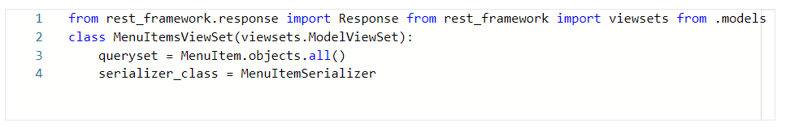
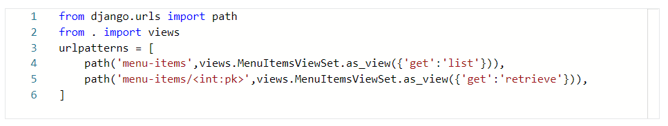
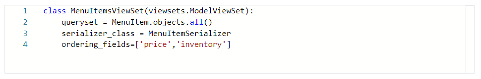
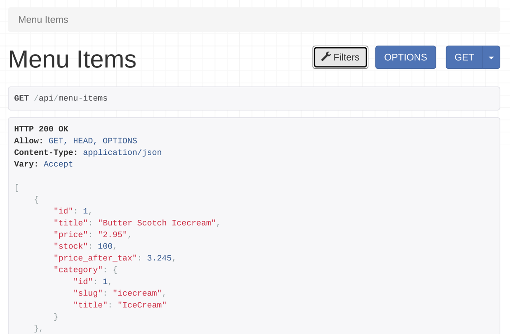
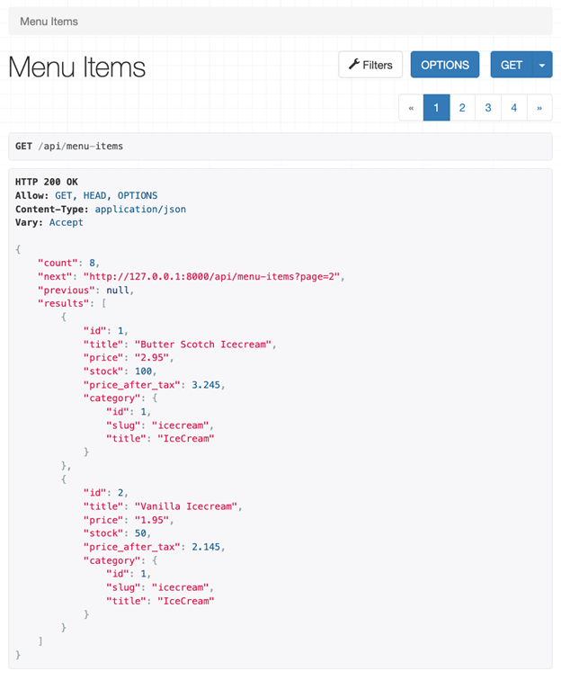
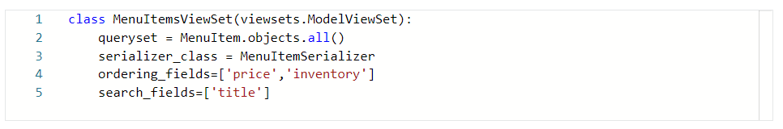
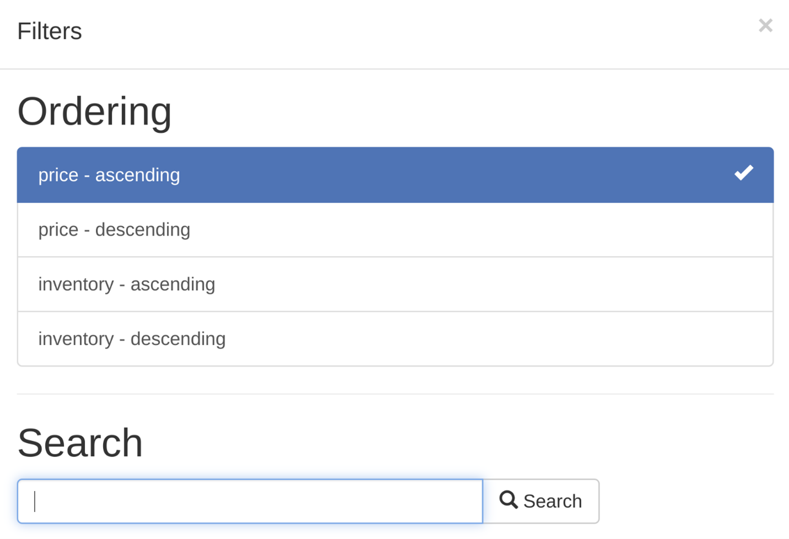
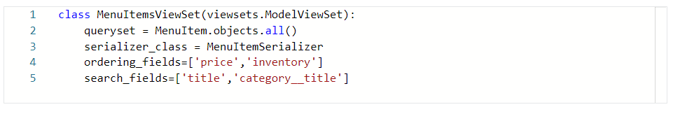
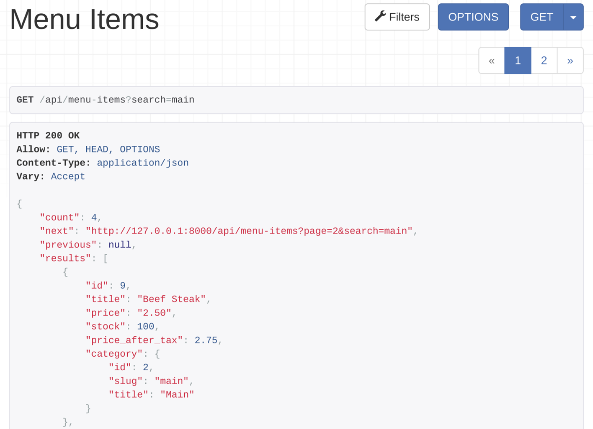

<h1>More on filtering and pagination</h1>

<h2>Introduction </h2>
You already know how to use filtering and pagination using function-based views in your DRF project. But, there are also some interesting filtering classes available in DRF which can help you to quickly implement these features in a class-based view. In this reading, you will learn how to use these built-in classes for filtering, searching and pagination. 

<h2>Scaffolding the project</h2>
<b>Step 1</b>
To scaffold the project you have to use a class-based view extending the ModelViewSet to quickly implement a functional CRUD API endpoint for the menu items. To create this class-based view you should add the following code lines in the views.py file.

<b>Step 2</b>
The second step is to open the urls.py file and map the MenuItemViewSet class to the menu-items endpoint. You only map the GET methods.

<b>Step 3</b>
The final step is to open the settings.py file and add OrderingFilter and SearchFilter classes as DEFAULT_FILTER_BACKENDS in the REST_FRAMEWORK section. 

After completing these steps you can list all menu items by visiting http://127.0.0.1:8000/api/menu-items and any single menu item by visiting http://127.0.0.1:8000/api/menu-items/1.

<h2>Ordering and sorting</h2>
To implement sorting by the price and inventory fields you can use DRF’s built-in ordering classes. You can do this by specifying these two fields in the ordering_fields list in the MenuItemsViewSet class.

If you visit http://127.0.0.1:8000/api/menu-items you’d notice a newfilter button on the top right-hand side like in this screenshot.

If you click on that button, a popup will appear where you can get the ordering options. 

You can click on any of these options to sort the /api/menu-items API output by order and inventory in ascending or descending order. You can also sort the output by both fields by using ordering=price,inventory query string, like this: http://127.0.0.1:8000/api/menu-items?ordering=price,inventory.

<h2>Pagination</h2>
Using DRF’s built-in pagination classes makes paginating the API result very easy. Add these two lines in the REST_FRAMEWORK section in the settings.py file.

'DEFAULT_PAGINATION_CLASS': 'rest_framework.pagination.PageNumberPagination',
'PAGE_SIZE': 2

The PAGE_SIZE property tells DRF how many items to show per page. Now if you were to visit the menu items endpoint you’d notice how the output has been paginated in the browsable API interface, and how the output data format has changed. Under the filter button, there are page numbers as well. Only two records per page show because that’s the setting in the settings.py file.

<h2>Search</h2>
You can add search capability so that API clients can search by title field. To do that, you add search_fields=['title'] in the MenuItemsViewSet class.

When you open the menu-items endpoint and click on the filter button there will be a new search field. You can use both ordering and searching together.

You can type anything, and DRF will search inside the title field and display the output accordingly. The default lookup_field value for searching in DRF is icontains. If the client searches for ILLA it will match every menu item where the title has ILLA in a case-insensitive fashion. So both Vanilla and VANILLA would come up as search results.   

Searching in the nested fields
What if the API client also wants to search a category title, like Icecream or main? In the serializers.py file, the category was set as a related field to the MenuItem model in the MenuItemSerializer class, and the clients will be searching in the title field of the category model. 

The naming convention for searching in the related model is, RelatedModelName_FieldName. Here, the related model name is category and the field name is title.   So, to search in the title field of the category model, you need to pass  category__title in the search_fields list.

By adding these lines of code, the API clients will be able to search for text in both menu item titles and category titles. Notice that the pagination and ordering still work together with the search feature.

<h2>Conclusion</h2>
In this reading, you learned how to implement complex features like filtering, pagination and searching with just a few lines of code in a class-based view using the built-in filtering and pagination classes in DRF. 