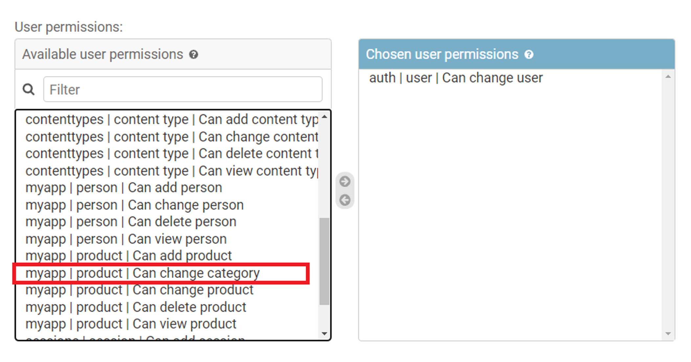

<h1>Enforcing Permissions</h1>

The Django Admin interface makes it possible to grant and enforce permissions to access the model data. By default, all users get the Add, Change, View and Delete permissions on all models.

If a model requires a user to gain access through special permissions, this can be granted through Django Admin.

<h2>Model Permissions in Admin Interface</h2>
Let’s assume that there is a Product model in a Django app named <b>myapp</b>. Here, a custom permission called <bchange_category> has been defined.

class Product(models.Model): 
    ProductID: models.IntegerField() 
    name : models.TextField() 
    category : models.TextField 
    class Meta: 
        permissions = [('can_change_category', 'Can change category')] 

This name of permission will be visible in the list of available user permissions when a new user is added or an existing group is edited.  

However, outside of the admin environment, the Django models by themselves don't have a mechanism to enforce permissions because it is unaware of the user identity that is performing the action.

The Django app receives user information through the <b>request </b> context. Often, permissions are enforced at the view layer. However, you can do so from inside <b>templates</b>, <b>URLs</b> and function-based and class-based views.

<h2>Enforcing permissions at the view level</h2>
If a user has logged in and has been authenticated, its details are available to the view function in the form of <b>request.user object</b>. If not, the value of <b>request.user</b> is an instance of <b>AnonymousUser</b>. In that case, the permission to call a view can be denied as follows:

from django.core.exceptions import PermissionDenied  
def myview(request): 
    if request.user.is_anonymous(): 
        raise PermissionDenied() 

Alternatively, you can decorate the view with a <b>login_required</b> decorator. It only allows access for logged users.   

from django.http import HttpResponse 
from django.contrib.auth.decorators import login_required 
 @login_required 
def myview(request): 
    return HttpResponse("Hello World") 

Another way of restricting access to a view is by using the <b>@user_passes_test()</b>decorator. It takes one mandatory argument, which is a function returning True or False. If True is returned, the decorated view function defined below it is invoked.

Let’s define a function <b>testpermission()</b>. It returns True if the user is authenticated and has a <b>change_category</b> permission.

def testpermission(user): 
    if user.is_authenticated() and user.has_perm("myapp.change_category"): 
        return True 
    else: 
        return False 

This function is then used as an argument to the <b>@user_passes_test()</b> decorator. The view function defined below it will be invoked if the <b>testpermission()</b> function returns True. 

from django.contrib.auth.decorators import user_passes_test 

@user_passes_test(testpermission) 
def change_ctg(request): 
    # Logic for making change to category of product model instance

The <buser_passes_test()> can be given an additional argument – login_url. The user will be redirected to this URL if the <b>testpermission()</b> function returns False. Typically, it is mapped to a view that renders a login page.

Another method to enforce permission at the view level is with the <b>@permission_required()</b> decorator. Unless the user possesses the permission mentioned as an argument, the view function won’t be called.

from django.contrib.auth.decorators import permission_required 

@permission_required("myapp.change_category") 
def store_creator(request): 
    # Logic for making change to category of product model instance    

The above example enforces the permission on a function-based view. Django framework also has a class-based view mechanism. 

To enforce permissions on a class-based view, you need to use <b>PermissionRequiredMixin</b> and set the <b>permission_required</b> attribute of the view class to the permission you want to enforce.

Here is an example:

Assuming that a product model is present in <b>models.py</b>. The ProductListView class view renders a list of products only if the user has view permission on this model.

from django.contrib.auth.mixins import PermissionRequiredMixin 
from django.views.generic import ListView 

from .models import Product 

class ProductListView(PermissionRequiredMixin, ListView): 
    permission_required = "myapp.view_product" 
    template_name = "product.html" 
    model = Product

<h2>Enforcing permissions in Template</h2>
To generate dynamic content on the web page, Django uses its own template language. Along with conditional and iterative statements (<b>if</b> and <b>for</b>), the special variables user and perms are available inside the template language blocks. 

These variables are passed into the template context by the view function. Then, you can check various user attributes, such as <b>is_authenticated </b>and render the information on the web page accordingly. A typical template looks like this:

<html> 
<body> 
 
         {#  to be rendeed if the user has been authenticated  #} 
    	 
<body> 
</html>

Similarly, the available permissions can be checked inside the template with <b>perms.name syntax</b>.  
For example:

<html> 
<body> 
 
  {#  To be rendered for users having required permission #} 
    
<body> 
</html>

<h2>Enforcing permissions in URL patterns</h2>
This method is especially useful when there’s a view function to intercept the request and the URL directly sends the control to a static page. 

To configure the pattern, you use the <h2>url()</h2> function, in which the permission decorators can be used.

from django.conf.urls import url 
from django.contrib.auth.decorators import login_required, permission_required 

urlpatterns = [ 
    url(r'^users_only/', login_required(myview)), 

    url(r'^category/', permission_required('myapp.change_category', login_url='login')(myview)), 
] 

In this reading, you learned about the various available methods to enforce permissions. It can be done through the admin site, at the view level, inside the template as well as while defining URL patterns. 