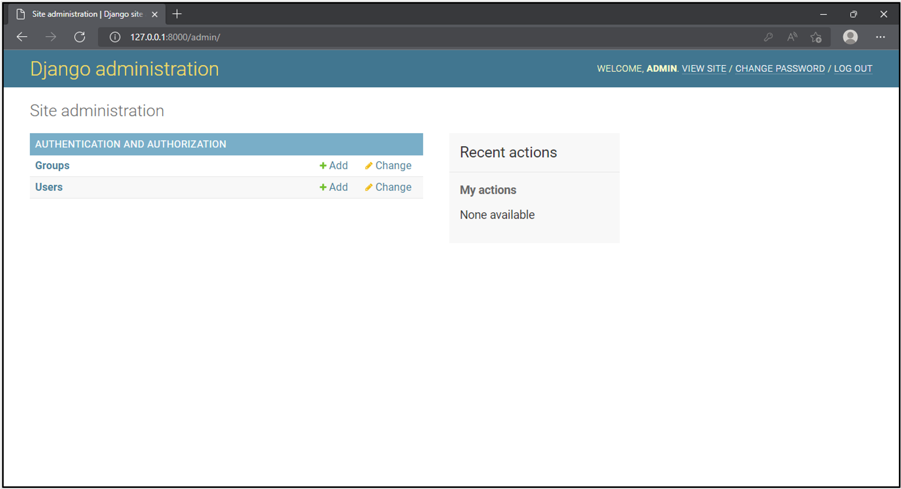
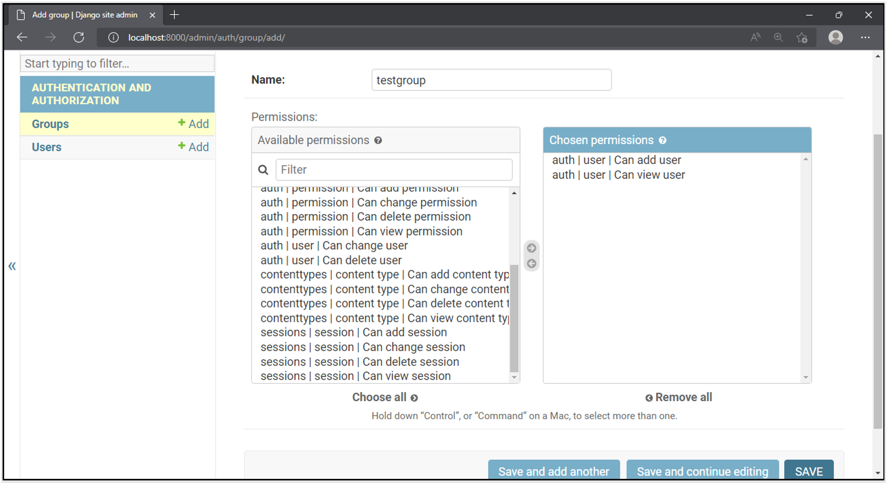
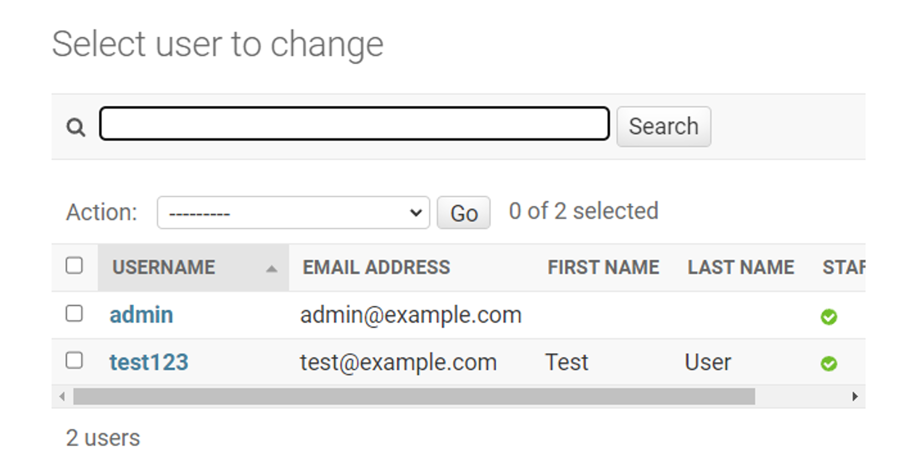
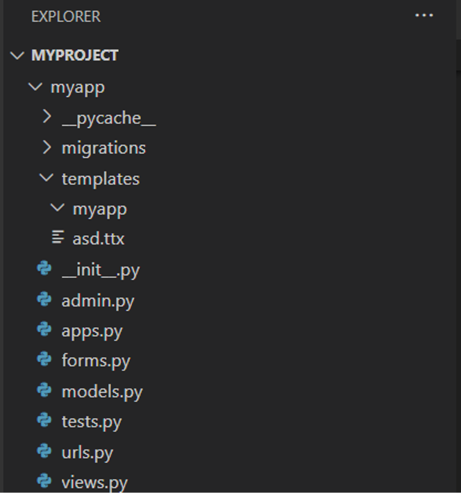
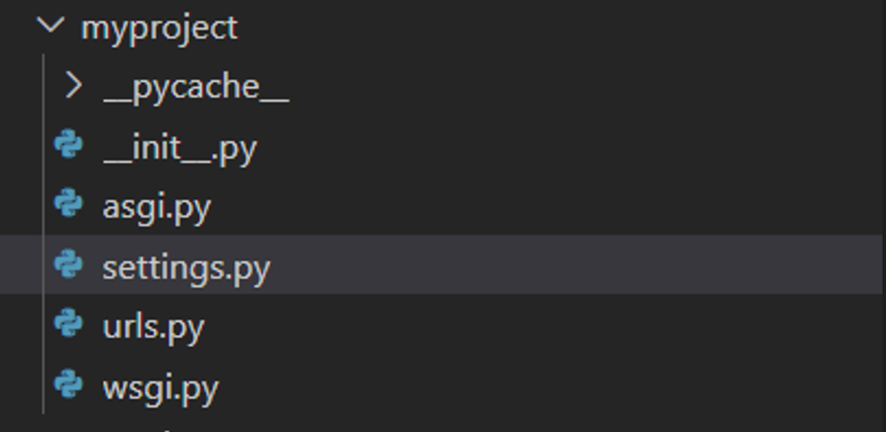
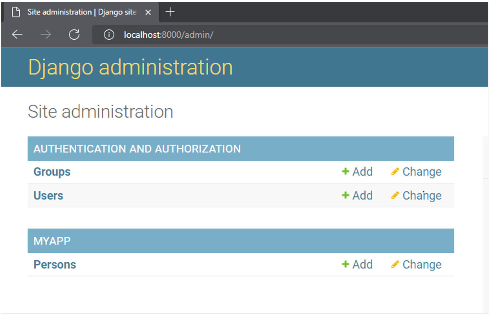
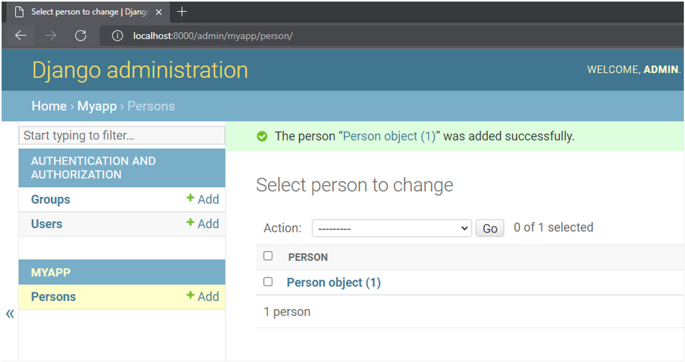
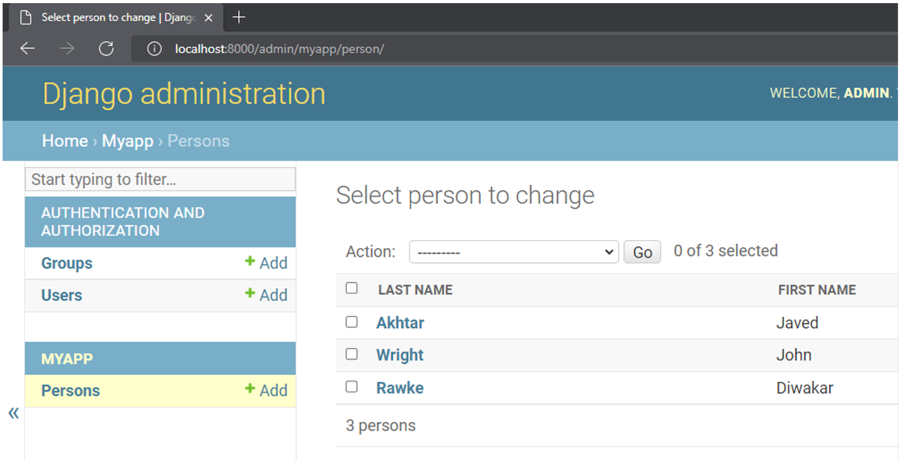
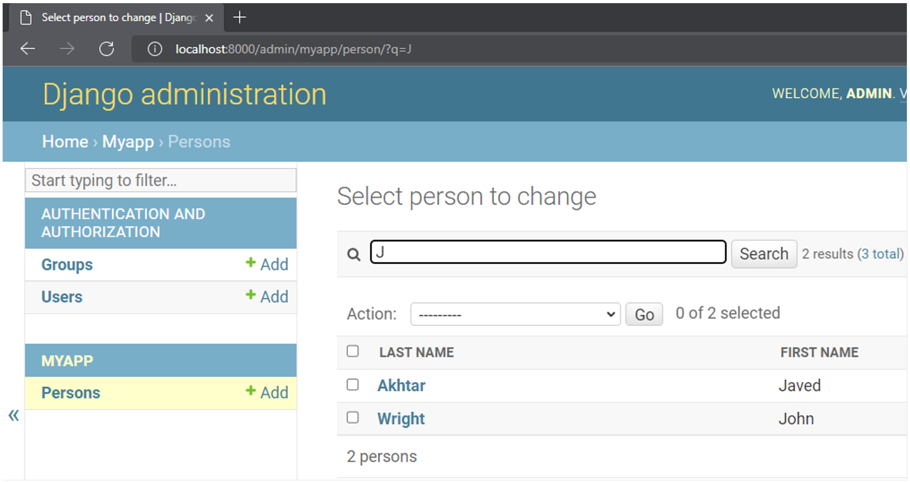

<h1>Managing users in Django Admin</h1>

Django’s authorization and authentication system are provided by django.contrib.admin app, which is installed by default. It can be seen in the INSTALLED_APPS in the project’s settings.py file.

A super user has the privilege to add or modify users and groups. As you log in as a super user, the admin interface appears as below:

One can add users through the interface, which is straightforward. It’s as easy as following the onscreen instructions.

A user without permission to perform any task is virtually useless. Different permissions can be granted to the user individually or by creating a group with a set of permissions. Users can be added to the group so that a set of users with common permissions is created. 

If a user’s <b>is_staff</b> property is set to True, it can log in to the admin interface. 

Django admin’s user management system is very efficient, yet it can be tricky. Unless you grant the permissions to the users very judiciously, the system might be put at considerable risk.

Even though Django’s admin site provides a very easy-to-use interface to add and modify users and groups, there are no real restrictions as the User admin. 

For example, a user with a staff status can manage the other users. But they can also edit their own permissions, which is not warranted. A staff user can also allocate superuser rights. The out-of-box implementation of the admin site doesn’t prevent this. 

So, what do you do to resolve this?

Let’s assume that the Django site has a superuser named Admin and a user named <b>test123</b> with staff status enabled.

To customize the User Admin, first, unregister the existing user profile and register a new one.

Use the following steps to unregister a user:

Add the following statements in the app’s <b>admin.py</b>.

from django.contrib, import admin 
# Register your models here.  
from django.contrib.auth.models, import User 
# Unregister the provided model admin:  
admin.site.unregister(User) 

To register our own admin, use <b>@admin.register() </b>decorator. Give the user a model as the argument. Decorate a sub-class of <b>UserAdmin</b> class.

from django.contrib.auth.admin import UserAdmin 
@admin.register(User) 
class NewAdmin(UserAdmin): 
    pass 

You can now add some customizations to how the User Admin functions. At this point, though, if you log in with the super user credentials, there’s no change in the interface.

Next, you’ll explore how to prevent any admin user from changing the content of one or more fields of a model.

The <b>UserAdmin</b> class has a property called <b>readonly_fields</b>. You can specify a list of fields that you want the user (or a super user) to be prevented from modifying.

The user model has a field <b>date_joined</b>. Suppose you want that its value given at the time of creating a new user should never be changed. So, keep this field in the <b>readonly_fields</b> list.

Modify the app’s admin.py by changing the <b>NewAdmin</b> class as follows. Include this at the end of <b>admin.py</b>.

from django.contrib.auth.admin import UserAdmin 
@admin.register(User) 
class NewAdmin(UserAdmin): 
    readonly_fields = [ 
        'date_joined', 
    ] 

Django Admin’s change form will show <b>date_joined</b> field as disabled, thereby, it will not be editable.

Instead of restricting all the staff users from changing the value of a certain field, it is possible to allow it for some users and prevent others.

For example, the user model has a username field. If any user accidentally modifies the username field of the other user, it may create many problems. Like the other user may not be able to log in. The ideal solution for this situation is to rest this privilege only with the super user and nobody else.

Now, explore how this is done:

The <b>UserAdmin</b> class (the base class for <b>NewAdmin</b> class that you have registered in the admin site) has a method known as <b>get_form()</b>. You need to override it to disable the username field in it.

def get_form(self, request, obj=None, **kwargs): 
        form = super().get_form(request, obj, **kwargs) 

It generates the change form for a model.

Next, verify if the current user is a super user. If yes, disable the username field in the form.

is_superuser = request.user.is_superuser 

        if not is_superuser: 
            form.base_fields['username'].disabled = True 

The <b>NewAdmin</b> class that is registered as admin will now look like this:

from django.contrib.auth.admin import UserAdmin 
@admin.register(User) 
class NewAdmin(UserAdmin): 
    def get_form(self, request, obj=None, **kwargs): 
        form = super().get_form(request, obj, **kwargs) 
        is_superuser = request.user.is_superuser 

        if not is_superuser: 
            form.base_fields['username'].disabled = True 

        return form 

If you now log in as a staff user and try to modify the username of another user, it will not be allowed.

Now, let’s customize the view of models from the apps added to the project.

Add a Django app named as <b>myapp</b>. Then, register this app in the <b>INSTALLED_APPS</b> list of the project’s <b>settings.py</b>.

INSTALLED_APPS = [ 
    'django.contrib.admin', 
    'django.contrib.auth', 
    'django.contrib.contenttypes', 
    'django.contrib.sessions', 
    'django.contrib.messages', 
    'django.contrib.staticfiles', 
    'myapp.apps.MyappConfig', 
] 

Let us add a person model. Add the following code in the <b>models.py</b> file, in the <b>myapp</b> folder.

From django.db import models. 

class Person(models.Model): 
    last_name = models.TextField() 
    first_name = models.TextField() 

You need to register this model in the admin.py code.

From django.contrib import admin. 

# Register your models here. 
from .models import Person 
admin.site.register(Person) 

Log in with the super user username and password. You’ll now see the models from <b>myapp</b>.

Let’s add a Person object. The following view shows that the one-person object is added.

Instead of the count of objects currently present, you would like to have a more meaningful output. To do that, add <b>__str__()</b> method to Person class. The string representation of the object will show the first and last name in concatenated form.

From django.db import models. 

class Person(models.Model): 
    last_name = models.TextField() 
    first_name = models.TextField() 

    def __str__(self): 
        return f"{self.last_name}, {self.first_name}" 

To further customize how the models are displayed in the admin interface, decorate a subclass of <b>ModelAdmin</b> and register it with <b>@admin.register()</b> decorator (just as you did with <b>UserAdmin</b>). Set the <b>list_display </b>attribute of this class to display the fields in columns.

From django.contrib import admin. 

from .models import Person 
@admin.register(Person) 
class PersonAdmin(admin.ModelAdmin): 
    list_display = ("last_name", "first_name") 

The person model is displayed in the interface with the first and last names in two columns. The columns are clickable so that the object can be edited.

Further, you can provide a search field so that the objects satisfying the filter will be displayed only. Here, the filter is applied to the first name starting with the given letter.

From django.contrib import admin. 

# Register your models here. 
from .models import Person 
@admin.register(Person) 
class PersonAdmin(admin.ModelAdmin): 
    list_display = ("last_name", "first_name") 
    search_fields = ("first_name__startswith", ) 

In this reading, you learned how to manage users by creating individual user profiles and user groups using Django’s Admin panel.