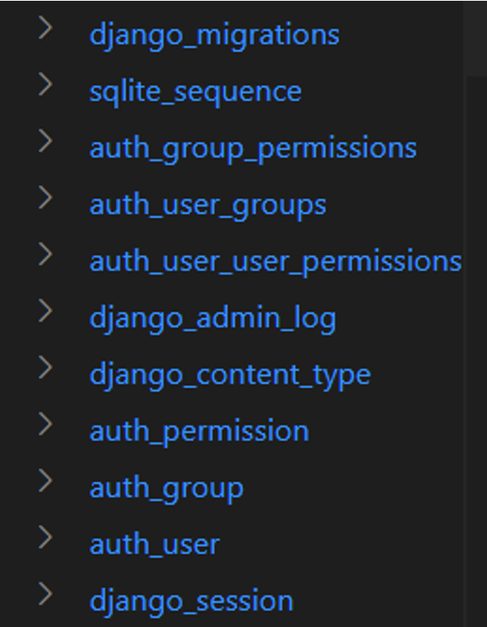

<h1>How to use migrations</h1>
Django translates the models into respective database tables in the backend database with a mechanism known as migration. It also propagates any changes in the model structure such as adding, modifying or removing a field attribute of a model class to the mapped table.

Django’s migration system has the following commands:
<ul>
    <li>makemigrations</li>
    <li>migrate</li>
    <li>sqlmigrate</li>
    <li>showmigrations</li>
</ul>

Django’s migration is a version control system. Whenever you add a new model or effect changes in an existing model, you need to run the <b>makemigrations</b> command. It creates a script for making changes in the mapped table. Every time you run the <b>makemigrations</b> command and Django detects the changes, a script with its name and version number is created. To implement the changes according to the migration script, you need to run the migrate command.

<h2>Migrating Models of INSTALLED APPS</h2>
When you create a Django project with the <b>startproject</b> command, certain apps are installed by default. These apps are listed in the <b>INSTALLED_APPS</b> section in the project’s <b>settings.p</b>y file.

INSTALLED_APPS = [ 
    'django.contrib.admin', 
    'django.contrib.auth', 
    'django.contrib.contenttypes', 
    'django.contrib.sessions', 
    'django.contrib.messages', 
    'django.contrib.staticfiles', 
] 

Data needs to be stored via these apps for their functionality to work. For example, the <b>auth</b> package controls the users, groups, and permissions, so there must be corresponding tables created in the database. Django uses the SQLite database by default. For that purpose, you run the <b>migrate</b> command.

python manage.py migrate 

Then, the tables required by the <b>INSTALLED_APPS</b> are created.

Let’s create an app inside our Django project.

(django) C:\django\myproject> python manage.py startapp myapp 

This creates a <b>myapp</b> package folder inside the outer <b>myproject</b> folder. Inside <b>myapp</b>, a <b>migrations</b> package is also created, which is empty to begin with.

<h2>Using the makemigrations command</h2>

Open the <b>models.py</b> file and add a person model to it.

from django.db import models 
class Person(models.Model): 
    name = models.CharField(max_length=20) 
    email = models.EmailField() 
    phone = models.CharField(max_length=20) 

The first step towards creating the Person table in the database is to run the <b>makemigrations</b> command.

django) C:\django\myproject>python manage.py makemigrations 
Migrations for 'myapp': 
  myapp\migrations\0001_initial.py 
    - Create model Person 

Notice that in the <b>migrations</b> package, a migration script <b>0001_initial.py</b>, is created. It indicates what the script intends to do, which is: <b>Create model Person</b>.

If you open the <b>migration</b> file, you’ll find a migration class in it.

from django.db import migrations, models  

class Migration(migrations.Migration): 

    initial = True 

    dependencies = [ 
    ] 

    operations = [ 
        migrations.CreateModel( 
            name='Person', 
            fields=[ 
                ('id', models.BigAutoField(auto_created=True, primary_key=True, serialize=False, verbose_name='ID')), 
                ('name', models.CharField(max_length=20)), 
                ('email', models.EmailField(max_length=254)), 
                ('phone', models.CharField(max_length=20)), 
            ], 
        ), 
    ] 

As mentioned above, you need to run the <b>migrate</b> command to apply the tasks in the <b>migrations</b> file to be performed.

(django) C:\django\myproject>python manage.py migrate        
Operations to perform: 
  Apply all migrations: admin, auth, contenttypes, myapp, sessions 
Running migrations: 
  Applying myapp.0001_initial... OK 

Have a look at the tables in your database <b>db.sqlite3</b>. The person table with three fields can be seen in it.

<h2>Version control</h2>
Now, let's modify the person model class by changing the <b>name</b> field to <b>Person_name </b>and running <b>makemigrations</b> again.

(django) C:\django\myproject>python manage.py makemigrations 
Was person.name renamed to person.person_name (a CharField)? [y/N] y 
Migrations for 'myapp': 
  myapp\migrations\0002_rename_name_person_person_name.py 
    - Rename field name on person to person_name 

A second migration script is created in the <b>migrations</b> folder. Before finalizing the change, add a new field – age – in the person model and run <b>makemigrations</b> again.

(django) C:\django\myproject>python manage.py makemigrations 
Migrations for 'myapp': 
  myapp\migrations\0003_person_age.py 
    - Add field age to person 

<h2>Showmigrations command</h2>
Now there are two unmigrated changes in the model. Run the <b>showmigrations</b> command:
(django) C:\django\myproject>python manage.py showmigrations 
. . . 
. . . 
myapp 
[X] 0001_initial 
[ ] 0002_rename_name_person_person_name 
[ ] 0003_person_age 
. . . 

The initial migration <b>(file numbered 0001)</b> has already migrated. The X mark is indicative of this. However, the next two migrations don’t show the X mark, which means they are pending. If we run the <B>migrate</B> command, both modifications will be reflected in the table structure.

(django) C:\django\myproject>python manage.py migrate        
Operations to perform: 
  Apply all migrations: admin, auth, contenttypes, myapp, sessions 
Running migrations: 
  Applying myapp.0002_rename_name_person_person_name... OK 
  Applying myapp.0003_person_age... OK 

As mentioned earlier, Django’s migration mechanism provides efficient version control. You may want to fall back upon the table structure before adding the <b>age</b> field. Run the <b>migrate</b> command and specify which migration file to be used so that the migrations after it will be undone or unapplied.

(django) C:\django\myproject>python manage.py migrate myapp 0002_rename_name_person_person_name   
Operations to perform: 
  Target specific migration: 0002_rename_name_person_person_name, from myapp 
Running migrations: 
  Rendering model states... DONE 
  Unapplying myapp.0003_person_age... OK 

<h2>sqlmigrate Command</h2>
Lastly, the <b>sqlmigrate</b> command shows the SQL query or queries executed when a certain migration script is run. For example, the first migration over the <b>myapp’s</b> person model is intended to create the person table. The <b>sqlmigrate</b> command for this script shows the <b>CREATE TABLE</b> statement for this purpose.

(django) C:\django\myproject>python manage.py sqlmigrate myapp 0001_initial  
BEGIN; 
-- 
-- Create model Person 
-- 
CREATE TABLE "myapp_person" ("id" integer NOT NULL PRIMARY KEY AUTOINCREMENT, "name" varchar(20) NOT NULL, "email" varchar(254) NOT NULL, "phone" varchar(20) NOT NULL); 
COMMIT;

In this reading, you learned about when to use migrations, best practices and that the migration system in Django manages data creation and modification very effectively and efficiently.