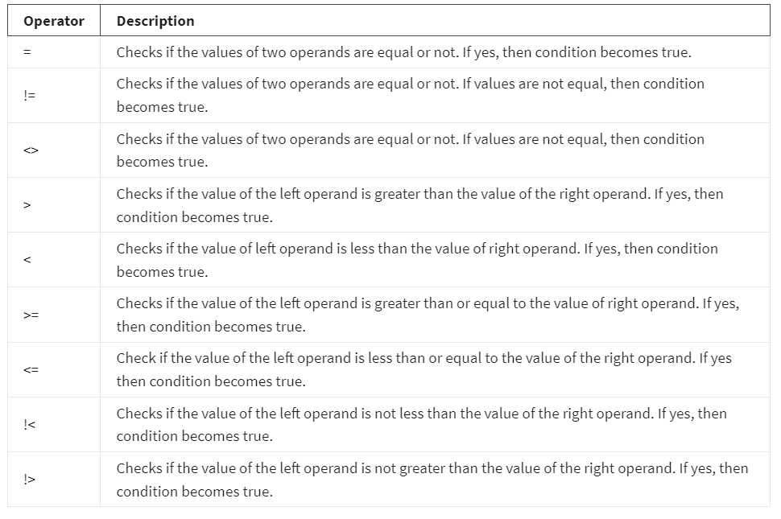

<h1>WHERE Clause uses</h1>
In this reading, you’ll explore the usage of the WHERE clause for filtering data. You’ve learned about the purpose and the syntax of the WHERE clause. You’ve also learned how it behaves with different types of operands (namely text-based or numeric) based on the data type of the table column. You explored the types of operators that can be used in the WHERE clause. The main objective of this reading is to present some more examples and scenarios in which the WHERE clause is used to filter data in a table.

<h2>The WHERE clause</h2>
The WHERE clause is useful when you want to filter data in a table based on a given condition in the SQL statement.The WHERE clause in SQL is there for the purpose of filtering records and fetching only the necessary records. This can be used in SQL SELECT, UPDATE and DELETE statements.

The filtering happens based on a condition. The condition can be written using any of the following comparison or logical operators.

<h2>Comparison operators</h2> 

<h2>Logical operators</h2>

Using the sample database, let’s review an example that uses the comparison operator > (greater than) to formulate the WHERE clause condition to filter criteria. If you want to fetch the invoices that have a total value of more than $2, you will need to filter out the records in the invoicetable by using the WHERE clause in the SELECT statement. 

To perform this action, you can run the following query:

SELECT *   

FROM invoices  

WHERE Total > 2; 

You’ll notice that this query filters out the records based on the condition given in the WHERE clause Total > 2. It brings in only the records that have a totalfield value of more than $2. But what if you want to combine multiple conditions in the WHERE clause? Multiple conditions in the WHERE clause can be combined using the AND / OR logical operators. Therefore, these two operators are also known as conjunctive operators.

The syntax required to use the AND operator in the WHERE clause of a SELECT statement is as follows:

SELECT column1, column2, columnN  

FROM table_name 

WHERE [condition1] AND [condition2]...AND [conditionN]; 

N can be any number. Here, for the entire condition to be TRUE, all conditions separated by the AND must be TRUE.

Let’s review an example. You need a list of invoices for which the total is over $2 and the BillingCountry is the USA. Here’s an example of how the WHERE clause condition can be given in the SELECT statement:

SELECT *  

FROM invoices 

WHERE Total > 2 AND BillingCountry = 'USA'; 

Here, the AND operator is used as a conjunctive operator to combine the two conditions Total > 2 AND BillingCountrywhich is the USA. You'll receive the invoice records with a total bill value of more than $2 with the USA as billing country. This means that for a record to be included in the result, both the conditions should be true. Similarly, the OR operator can also be used to combine multiple conditions in the WHERE clause. 

The syntax is as follows:

SELECT column1, column2, columnN  

FROM table_name 

WHERE [condition1] OR [condition2]...OR [conditionN] 

Let’s continue to use the same invoicestable for the next example. If you want to get a list of invoices for which the BillingCountryis the USA or France, how would you use the OR operator to combine the two conditions?

You can write the following SQL syntax:

SELECT *  

FROM invoices 

WHERE BillingCountry = 'USA' OR BillingCountry='France'; 

You’ll notice that the result consists of records where the billing country is the USA or France. This means that for a record to be included in the result, either condition should be true. 

Let’s consider another scenario. If you want to get a list of invoices where the total value is over $2 and the BillingCountry is USA or France, here’s the syntax for the SELECT query using both AND / OR conjunctive operators together in the WHERE clause:

SELECT *  

FROM invoices  

WHERE Total > 2 AND (BillingCountry = 'USA' OR BillingCountry = 'France'); 

You’ll notice that it has filtered out the invoice records that have a total value of more than $2.From that result, it has also filtered out the records that have a country value of either the USA or France. In the query, the two conditions combined with the OR operator are surrounded by a pair of parentheses to ensure that they are evaluated as one single expression. 

The other SQL logical and comparison operators which were not demonstrated in this reading can also be used in the WHERE clause. In addition, the WHERE clause can also be used with UPDATE and DELETE statements. To learn more, consult the additional resources reading of this lesson.
